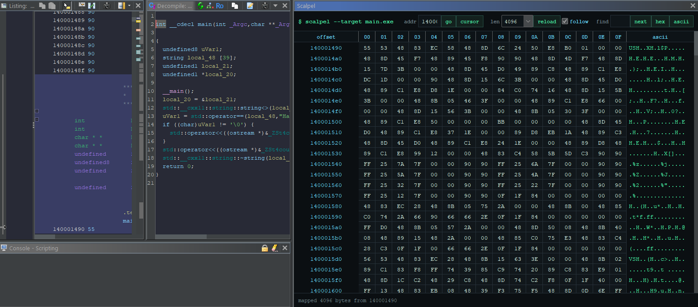

# Scalpel

Dark-mode hex editing for Ghidra

Scalpel is a native Java/Swing Ghidra extension for reverse engineers and any low-level programmers/researchers



## Features

- Dockable Ghidra tool window
- Dark terminal-inspired hex and ASCII grid
- Follows the current Listing cursor
- Jump to address
- Configurable read window from 256 bytes to 64 KiB
- Inline byte patching through Ghidra transactions
- Hex search with `??` wildcards
- Quoted UTF-8 search, for example `"MZ"` or `"powershell"`
- Copy selected bytes as hex or ASCII
- Handles unreadable memory ranges without crashing the view

## Style

BinEd's Ghidra extension helped anchor the packaging expectation: a Java extension with a dockable editor inside Ghidra

- [BinEd Ghidra Extension](https://bined.exbin.org/ghidra-extension/)

## Build

Install Ghidra and Gradle, then point Gradle at your Ghidra folder

Windows PowerShell:

```powershell
$env:GHIDRA_INSTALL_DIR="C:\path\to\ghidra_12.1_PUBLIC"
.\scripts\build.ps1
```

Linux:

```bash
export GHIDRA_INSTALL_DIR="$HOME/tools/ghidra_12.1_PUBLIC"
./scripts/build.sh
```

Optional wrapper setup:

```powershell
gradle wrapper --gradle-version 8.8
.\gradlew buildExtension
```

On Linux, the wrapper command is:

```bash
./gradlew buildExtension
```

The extension zip will be written under `dist/`

## Install

1. Open Ghidra.
2. Go to `File > Install Extensions`.
3. Select the Scalpel zip from `dist/`.
4. Restart Ghidra.
5. Open a program and choose `Window > Scalpel`

The extension zip is platform-neutral Java bytecode. A zip built on Windows can be installed on Linux, and a zip built on Linux can be installed on Windows, as long as the target Ghidra version is compatible

## Usage

Open the Scalpel window and move around the Listing. With `follow` enabled, the table reloads at the current cursor address. Type an address and press `go` to inspect another region

To patch a byte, edit a hex cell with a two-digit value such as `90`, `CC`, or `00`. Ghidra records the edit through a transaction named `Scalpel patch`

Search accepts contiguous or spaced hex:

```text
4D 5A
4D5A
48 8B ?? ?? 90
"powershell"
```

## Roadmap

- Diff mode against original bytes
- Byte histogram and entropy gutter
- Selection-driven Ghidra navigation
- Patch bookmarks
- Search across full memory blocks
- Import/export patch sets
